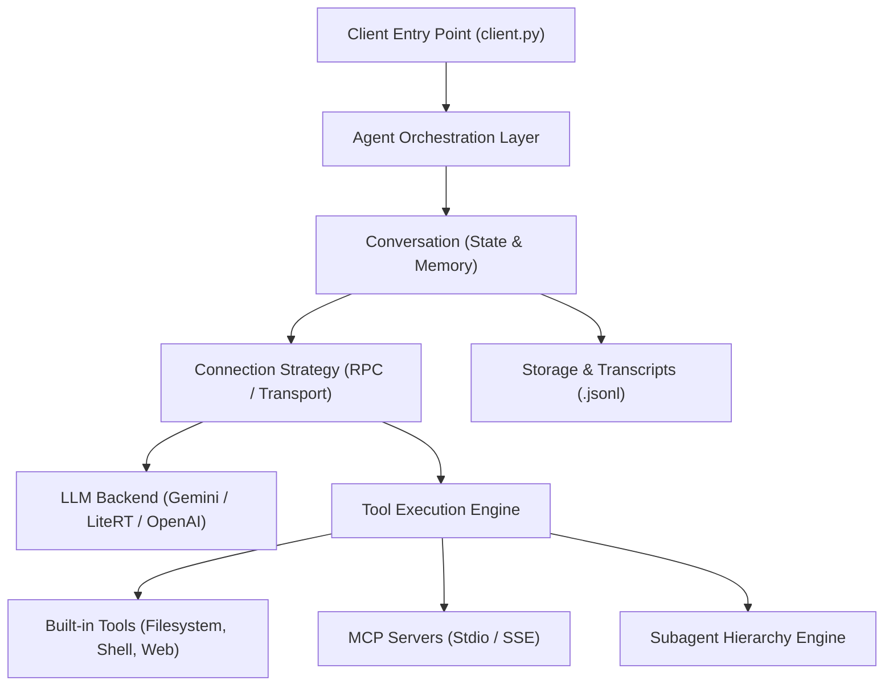
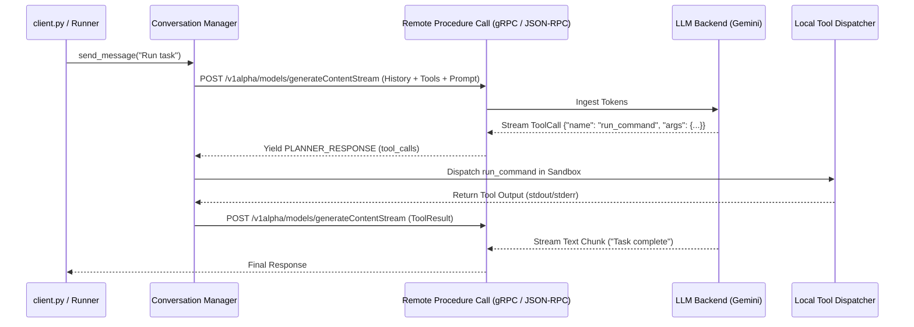

# Technical Architecture & System Specification

This document provides a comprehensive technical breakdown of the autonomous agentic application framework, detailing the orchestration layer, markdown instruction models, tool mechanisms, API & RPC communication flows (`client.py`), data schemas, memory/context management, and LLM configuration profiles.

---

## Table of Contents

1. [High-Level System Architecture](#1-high-level-system-architecture)
2. [Markdown Files & Instruction Hierarchy](#2-markdown-files--instruction-hierarchy)
3. [Tools & Capabilities Engine](#3-tools--capabilities-engine)
4. [API, Transport & `client.py` RPC Invocation](#4-api-transport--clientpy-rpc-invocation)
5. [Data Layer & Storage Architecture](#5-data-layer--storage-architecture)
6. [Memory & Context Management](#6-memory--context-management)
7. [LLM Configurations & Model Parameters](#7-llm-configurations--model-parameters)
8. [End-to-End Execution Sequence](#8-end-to-end-execution-sequence)

---

## 1. High-Level System Architecture

The framework is structured into three primary architectural pillars:



- **Agent**: The top-level controller defining agent personas, allowed tools, safety policies, capabilities, hooks, and operational boundaries.
- **Conversation**: The stateful session manager responsible for token accumulation, turn orchestration, history compaction, and reactive event wakeups.
- **Connection**: The abstract transport abstraction implementing gRPC, JSON-RPC, or REST adapters across local or cloud LLM backends.

---

## 2. Markdown Files & Instruction Hierarchy

Instruction and knowledge delivery relies on structured Markdown hierarchies:

```
├── System Instructions (Identity, constraints, behavioral rules)
├── Skills Hierarchy
│   └── <skill_name>/
│       ├── SKILL.md            # YAML frontmatter + executable workflows
│       ├── scripts/            # Helper automation scripts
│       ├── examples/           # Input/Output task patterns
│       └── references/         # Deep domain technical docs
└── Artifact Hierarchy (<appDataDir>/brain/<conversation_id>/)
    ├── implementation_plan.md  # Proposed architectural changes & review
    ├── walkthrough.md          # Post-execution verification & results
    └── scratch/                # Transient test scripts & scratchpads
```

### Instruction Ingestion Rules
1. **Core System Prompt**: Injected at conversation initialization, establishing identity, sandbox rules, and tool formatting requirements.
2. **`SKILL.md` Dynamic Loading**: Loaded on demand when domain triggers match specific user intents. Contains frontmatter metadata (`name`, `description`) and structured execution steps.
3. **Artifact Management**: Special markdown artifacts created for persistent user visibility, formatted with GitHub-flavored markdown, mermaid diagrams, KaTeX formulas, and diff blocks.

---

## 3. Tools & Capabilities Engine

Tools expose environment capabilities through standardized JSON schemas:

### A. Built-in Core Primitives

| Tool Category | Tool Name | Technical Functionality |
| :--- | :--- | :--- |
| **Filesystem (Read)** | `view_file` | Reads slices of text/binary files with line-indexing and byte offsets. |
| **Filesystem (Search)** | `grep_search` | Ripgrep-powered regex and exact substring matching across paths. |
| **Filesystem (Listing)** | `find_by_name`, `list_dir` | Directory traversal, smart-cased glob pattern filtering via `fd`. |
| **Filesystem (Write)** | `write_to_file` | Creates new files or overwrites existing artifacts with metadata tags. |
| **Filesystem (Edit)** | `replace_file_content` | Precision contiguous block replacements with target verification. |
| **Execution** | `run_command` | Executes shell commands in sandboxed or unsandboxed (`BypassSandbox`) modes. |
| **Process Control** | `manage_task` | Inspects, communicates with (`stdin`), or terminates background daemon tasks. |
| **Scheduling** | `schedule` | Schedules one-shot timers or recurring cron triggers for reactive wakeup. |
| **Agent Orchestration** | `invoke_subagent` | Launches parallel or nested subagents with isolated workspaces. |
| **Agent Definition** | `define_subagent` | Dynamically registers specialized subagent roles at runtime. |
| **Web & Research** | `search_web`, `read_url_content` | Performs web queries and parses remote URLs into clean Markdown. |
| **User Interaction** | `ask_question` | Renders interactive multi-choice question prompts to resolve ambiguities. |

### B. Model Context Protocol (MCP) Integration
External services connect over Stdio or Server-Sent Events (SSE):
- Agent establishes JSON-RPC channels to external MCP servers.
- Exposes external database connectors, cloud devtools, and third-party APIs directly to the LLM context.

---

## 4. API, Transport & `client.py` RPC Invocation

### How `client.py` Orchestrates Agent RPCs

`client.py` initializes the environment, builds the schema definitions, establishes the connection channel, and manages bidirectional streaming.

```python
# Conceptual Flow inside client.py / Agent Invocation
import asyncio
from google_antigravity import Agent, LocalAgentConfig, CapabilitiesConfig, BuiltinTools

async def main():
    # 1. Configure the Agent & Capabilities
    config = LocalAgentConfig(
        model="gemini-2.5-pro",
        capabilities=CapabilitiesConfig(
            tools=[
                BuiltinTools.VIEW_FILE,
                BuiltinTools.EDIT_FILE,
                BuiltinTools.RUN_COMMAND,
                BuiltinTools.SEARCH_WEB
            ]
        ),
        system_instruction="You are an autonomous senior engineer...",
        temperature=0.2
    )

    # 2. Instantiate Agent & Establish Session
    async with Agent(config) as agent:
        conversation = agent.create_conversation()
        
        # 3. Stream turns over RPC
        async for step in conversation.chat("Analyze repository and implement feature"):
            if step.is_tool_call:
                print(f"[RPC] Dispatching Tool: {step.tool_name}({step.tool_args})")
            elif step.is_chunk:
                print(step.text, end="", flush=True)

if __name__ == "__main__":
    asyncio.run(main())
```

### Turn RPC Lifecycle & Message Payload



---

## 5. Data Layer & Storage Architecture

### File & Transcript Format (`.jsonl`)
All conversational steps, thinking traces, and tool results are recorded into two synchronized append-only JSONL files:

1. **`transcript_full.jsonl`**: The exhaustive, uncompressed event stream containing exact model reasoning, arguments, and full tool outputs.
2. **`transcript.jsonl`**: Token-efficient compressed mirror where massive outputs are truncated with `truncated_fields: ["content"]` to protect local memory.

```json
{
  "step_index": 12,
  "source": "MODEL",
  "type": "PLANNER_RESPONSE",
  "status": "DONE",
  "created_at": "2026-09-04T22:32:00Z",
  "thinking": "Validating parameters before executing build script...",
  "tool_calls": [
    {
      "name": "run_command",
      "args": {
        "CommandLine": "mvn clean compile",
        "Cwd": "/workspace",
        "WaitMsBeforeAsync": 5000
      }
    }
  ]
}
```

---

## 6. Memory & Context Management

```
┌─────────────────────────────────────────────────────────────┐
│                    ACTIVE CONTEXT WINDOW                    │
│                                                             │
│  ┌──────────────────┐  ┌─────────────────┐  ┌────────────┐  │
│  │ System Prompt &  │  │ Dynamic Skills  │  │ Short-Term │  │
│  │ Tool Definitions │  │ (SKILL.md)      │  │ Turn Trace │  │
│  └──────────────────┘  └─────────────────┘  └────────────┘  │
└─────────────────────────────────────────────────────────────┘
                               ▲
                               │ Compaction / Truncation
┌──────────────────────────────┴──────────────────────────────┐
│                    LONG-TERM MEMORY STORE                   │
│                                                             │
│  ┌───────────────────────────┐  ┌────────────────────────┐  │
│  │ transcript_full.jsonl     │  │ Artifacts & State Files│  │
│  │ (Full historical record)  │  │ (license.properties)   │  │
│  └───────────────────────────┘  └────────────────────────┘  │
└─────────────────────────────────────────────────────────────┘
```

1. **Short-Term Conversational Memory**:
   - Maintains rolling turns (User messages, Planner thinking, Tool Invocations, and Tool Outputs).
   - Ingests reactive wakeups from background tasks, timers, and subagent completion messages automatically at invocation start.
2. **Context Compaction & Token Budgeting**:
   - Truncates oversized outputs from tools (e.g. giant search results or log outputs) using line and byte-limit buffers.
   - Preserves reasoning budgets by tracking `thinking_tokens`, `input_tokens`, and `output_tokens`.
3. **Subagent Memory Isolation**:
   - Subagents execute inside separate Conversation IDs with isolated memory buffers.
   - Workspaces can be configured as `inherit` (same folder), `branch` (isolated copy), or `share` (git worktree).

---

## 7. LLM Configurations & Model Parameters

Supported execution profiles and parameter matrices:

| Profile | Target Model Identifier | Default Use Case | Reasoning / Thinking Budget |
| :--- | :--- | :--- | :--- |
| **Pro Reasoning** | `gemini-2.5-pro` | Complex architecture, large-scale refactors, deep debugging | Dynamic high-budget thinking |
| **Flash General** | `gemini-2.5-flash` / `gemini-3.7-flash` | Fast coding, CLI management, multi-tool workflows | Balanced thinking tokens |
| **Flash Lite** | `gemini-2.5-flash-lite` | File lookups, quick syntactic checks, status polling | Low latency, no thinking tokens |
| **On-Device** | LiteRT (Gemma 2 / Gemma 3) | Local air-gapped execution without network credentials | Model-dependent local buffer |
| **OpenAI Adapter**| Local OpenAI Server | Local Ollama / LM Studio instances via REST | Server-dependent |

### Configuration Parameters
- **`temperature`**: Set to `0.0` - `0.2` for deterministic code generation and strict tool conformance.
- **`safety_policies`**: Execution policies governing tool safety (e.g., sandboxed execution, auto-approving read actions, requiring authorization for destructive mutations).
- **`agent_behavior`**:
  - `AUTONOMOUS`: Resolves multi-step objectives end-to-end without interrupting the user.
  - `INTERACTIVE`: Employs conversational prompts and pauses for collaborative user direction.

---

## 8. Summary of Runtime Flow

```
1. client.py launches -> 2. Ingests AgentConfig & Tools -> 3. Initializes Conversation
   -> 4. Issues RPC Request to LLM -> 5. Receives Streaming Steps & Tool Calls
   -> 6. Dispatches Local/MCP Tool in Sandbox -> 7. Returns Tool Output via RPC
   -> 8. Updates JSONL Transcripts & Memory -> 9. Yields Structured Output to User
```
